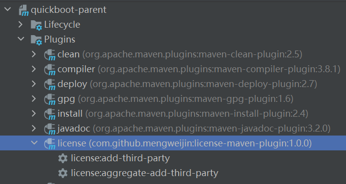

# license-maven-plugin

<p align="center">	
	<a target="_blank" href="https://search.maven.org/search?q=g:%22com.github.mengweijin%22%20AND%20a:%22license-maven-plugin%22">
		
	</a>
	<a target="_blank" href="https://github.com/mengweijin/license-maven-plugin/blob/master/LICENSE">
		
	</a>
	<a target="_blank" href="https://www.oracle.com/technetwork/java/javase/downloads/index.html">
		
	</a>
	<a target="_blank" href="https://gitee.com/mengweijin/license-maven-plugin/stargazers">
		
	</a>
	<a target="_blank" href='https://github.com/mengweijin/license-maven-plugin'>
		
	</a>
</p>

## Description
扫描项目中依赖的库的 LICENSE，对一些商业不友好的 LICENSE 发出失败告警。

开发依赖于 [https://www.mojohaus.org/license-maven-plugin/index.html](https://www.mojohaus.org/license-maven-plugin/index.html) 并且对其全兼容。

### 扩展项

- LICENSE 合并项
  - [AGPL](https://gitee.com/mengweijin/license-maven-plugin/blob/master/src/main/java/com/github/mengweijin/license/merge/impl/AGPL.java)
  - [APACHE](https://gitee.com/mengweijin/license-maven-plugin/blob/master/src/main/java/com/github/mengweijin/license/merge/impl/APACHE.java)
  - [BSD](https://gitee.com/mengweijin/license-maven-plugin/blob/master/src/main/java/com/github/mengweijin/license/merge/impl/BSD.java)
  - [CC0](https://gitee.com/mengweijin/license-maven-plugin/blob/master/src/main/java/com/github/mengweijin/license/merge/impl/CC0.java)
  - [CDDL](https://gitee.com/mengweijin/license-maven-plugin/blob/master/src/main/java/com/github/mengweijin/license/merge/impl/CDDL.java)
  - [EDL](https://gitee.com/mengweijin/license-maven-plugin/blob/master/src/main/java/com/github/mengweijin/license/merge/impl/EDL.java)
  - [EPL](https://gitee.com/mengweijin/license-maven-plugin/blob/master/src/main/java/com/github/mengweijin/license/merge/impl/EPL.java)
  - [EUPL](https://gitee.com/mengweijin/license-maven-plugin/blob/master/src/main/java/com/github/mengweijin/license/merge/impl/EUPL.java)
  - [FDL](https://gitee.com/mengweijin/license-maven-plugin/blob/master/src/main/java/com/github/mengweijin/license/merge/impl/FDL.java)
  - [GPL](https://gitee.com/mengweijin/license-maven-plugin/blob/master/src/main/java/com/github/mengweijin/license/merge/impl/GPL.java)
  - [LGPL](https://gitee.com/mengweijin/license-maven-plugin/blob/master/src/main/java/com/github/mengweijin/license/merge/impl/LGPL.java)
  - [MIT](https://gitee.com/mengweijin/license-maven-plugin/blob/master/src/main/java/com/github/mengweijin/license/merge/impl/MIT.java)
  - [MPL](https://gitee.com/mengweijin/license-maven-plugin/blob/master/src/main/java/com/github/mengweijin/license/merge/impl/MPL.java)
  - [MULAN](https://gitee.com/mengweijin/license-maven-plugin/blob/master/src/main/java/com/github/mengweijin/license/merge/impl/MULAN.java)
- 白名单
  - APACHE|BSD|CC0|CDDL|EDL|EPL|EUPL|FDL|LGPL|MIT|MPL|MULAN
- 黑名单
  - AGPL|GPL

## 项目引用
```xml
<plugin>
    <groupId>com.github.mengweijin</groupId>
    <artifactId>license-maven-plugin</artifactId>
    <version>Latest Version</version>
</plugin>
```

## 在 idea 中使用
执行后，会在 **target/generated-source/license** 下生成一个 txt 文件，其中保存了所有依赖库的 license 信息。




## 集成 Jenkins 可以执行如下命令
```bash
# 简写命令
mvn license:add-third-party
mvn license:aggregate-add-third-party

# 全命令
mvn com.github.mengweijin:license:add-third-party
mvn com.github.mengweijin:license:aggregate-add-third-party
```

更详细的使用可以参考：[https://www.mojohaus.org/license-maven-plugin/index.html](https://www.mojohaus.org/license-maven-plugin/index.html) 并且对其全兼容。

## Futures
You are welcome to suggest better ways to improve this widget.
## Contributions
You are welcome to contribute code, let more people more time to accompany the people you care about.
